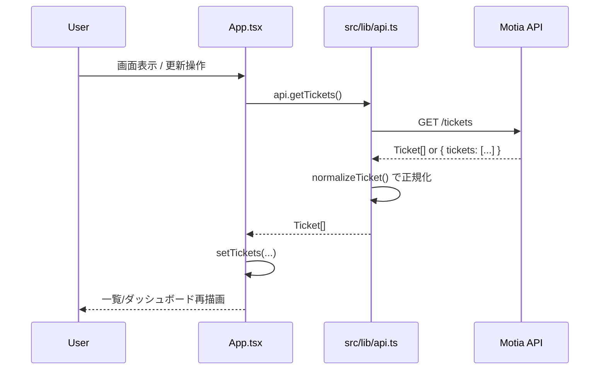
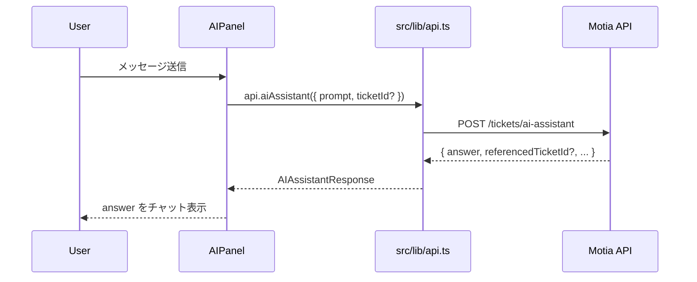

# Frontend (React + TypeScript + Vite)

Motiaベースのチケット管理システム向けフロントエンドです。
ダッシュボード、チケット一覧/詳細、チケット作成、AIアシスタント連携を1つのSPAとして提供します。

## 概要

- 技術スタック: React 19, TypeScript, Vite, ESLint, Biome
- UI構成: サイドバー + トップバー + メインコンテンツ + AIパネル
- 状態管理: `App.tsx` を親にしたローカル state（外部 state 管理ライブラリ未使用）
- API通信: `src/lib/api.ts` のAPIクライアントを経由して Motia API を呼び出し

画面遷移は `react-router` ではなく、`currentPage` state (`dashboard | tickets | detail | create | ai`) によるシンプルな切り替えです。

## セットアップ

### 1) 依存インストール

```bash
cd frontend
npm install
```

### 2) 環境変数設定（任意）

`VITE_API_BASE_URL` を設定すると、APIのベースURLを切り替えできます。

```bash
# 例: .env.local
VITE_API_BASE_URL=http://localhost:3111
```

未設定の場合、`src/lib/api.ts` では `""`（同一オリジン）を使用します。

### 3) 開発サーバ起動

```bash
npm run dev
```

## 主要スクリプト

- `npm run dev`: 開発サーバ起動
- `npm run build`: TypeScript ビルド + Vite ビルド
- `npm run preview`: ビルド結果のプレビュー
- `npm run lint`: ESLint 実行
- `npm run format`: Biome で整形

## フォルダ構成

```text
frontend/
  src/
    App.tsx                # 画面切り替えと全体状態管理のルート
    main.tsx               # エントリポイント
    types.ts               # フロントで使う型定義
    lib/
      api.ts               # Motia API クライアント
    components/
      Sidebar.tsx          # 左サイドナビ
      TopBar.tsx           # 上部バー
      AIPanel.tsx          # AIチャットパネル
      Toast.tsx            # トースト通知
    pages/
      DashboardPage.tsx    # ダッシュボード
      TicketListPage.tsx   # チケット一覧
      TicketDetailPage.tsx # チケット詳細/トリアージ/エスカレーション
      CreateTicketPage.tsx # チケット作成フォーム
      AIPage.tsx           # AI機能の導線ページ
    css/
      index.css            # グローバルスタイル
      App.css              # 画面・コンポーネントスタイル
    assets/                # 静的アセット
  public/                  # 公開静的ファイル
```

## Motia API の呼び出し方

### 実装方針

`src/lib/api.ts` で共通 `request<T>()` を定義し、各APIをラップしています。

- `Content-Type: application/json` を標準付与
- 非2xxはレスポンス本文を `Error` として投げる
- 返却JSONを型付きで扱う

### 利用可能なAPIメソッド

- `api.getTickets()`
- `api.createTicket(payload)`
- `api.triageTicket(payload)`
- `api.escalateTicket(payload)`
- `api.aiAssistant(payload)`

### エンドポイント対応表

| APIクライアント  | Method | Path                    | 用途                       |
| ---------------- | ------ | ----------------------- | -------------------------- |
| `getTickets`     | `GET`  | `/tickets`              | チケット一覧取得           |
| `createTicket`   | `POST` | `/tickets`              | チケット作成               |
| `triageTicket`   | `POST` | `/tickets/triage`       | チケットのトリアージ       |
| `escalateTicket` | `POST` | `/tickets/escalate`     | チケットのエスカレーション |
| `aiAssistant`    | `POST` | `/tickets/ai-assistant` | AIアシスタント問い合わせ   |

### 実際の呼び出し例

```ts
import { api } from "./lib/api";

// 一覧取得
const tickets = await api.getTickets();

// 作成
await api.createTicket({
  title: "Payment failed on checkout",
  description: "Card payment fails with PMT-402",
  priority: "high",
  customerEmail: "customer@example.com",
});

// AI問い合わせ（チケット文脈つき）
const ai = await api.aiAssistant({
  prompt: "このチケットの次アクションを提案して",
  ticketId: "TKT-xxxx",
});
console.log(ai.answer);
```

### レスポンス差異の吸収（重要）

バックエンドとの契約差異を `api.ts` 側で吸収しています。

- `GET /tickets` は `Ticket[]` と `{ tickets: [...] }` の両形式を許容
- 各チケットのIDは `ticketId` / `id` の両方を受け取り、`ticketId` に正規化
- `POST /tickets/ai-assistant` は `answer` フィールドを利用

この正規化により、ページコンポーネント側は `Ticket` 型に寄せて実装できます。

## 画面とAPIの対応

- `DashboardPage`: 取得済みチケットの集計表示（直接API呼び出しなし）
- `TicketListPage`: 取得済みチケット一覧表示（直接API呼び出しなし）
- `CreateTicketPage`: `api.createTicket` を実行
- `TicketDetailPage`: `api.triageTicket` / `api.escalateTicket` を実行
- `AIPanel`: `api.aiAssistant` を実行
- `App.tsx`: 初期表示と更新時に `api.getTickets` を実行

## データフロー図

### 全体フロー（画面操作 → Motia API → 再描画）

```mermaid
flowchart LR
  U[User Action]
  APP[App.tsx\nstate: currentPage / tickets]
  PAGE[Page / Component\nCreateTicketPage, TicketDetailPage, AIPanel]
  API[src/lib/api.ts\nrequest<T>()]
  ENV[VITE_API_BASE_URL]
  FETCH[fetch]
  MOTIA[Motia Backend API\n/tickets\n/tickets/triage\n/tickets/escalate\n/tickets/ai-assistant]
  RES[JSON Response]
  NORM[normalizeTicket\n(id/ticketId 吸収)]
  STATE[React State Update\nsetTickets / setCurrentPage]
  UI[UI Re-render]

  U --> APP
  APP --> PAGE
  PAGE --> API
  API --> ENV
  API --> FETCH
  ENV --> FETCH
  FETCH --> MOTIA
  MOTIA --> RES
  RES --> NORM
  NORM --> STATE
  STATE --> UI
```

### チケット取得フロー（初期表示・更新）



### AIアシスタントフロー



## 補足

- APIサーバが未起動時、`App.tsx` の初回取得は黙って失敗を握りつぶす設計です。
- API接続確認には `../my-project/sample.http` のエンドポイント例を利用できます。
